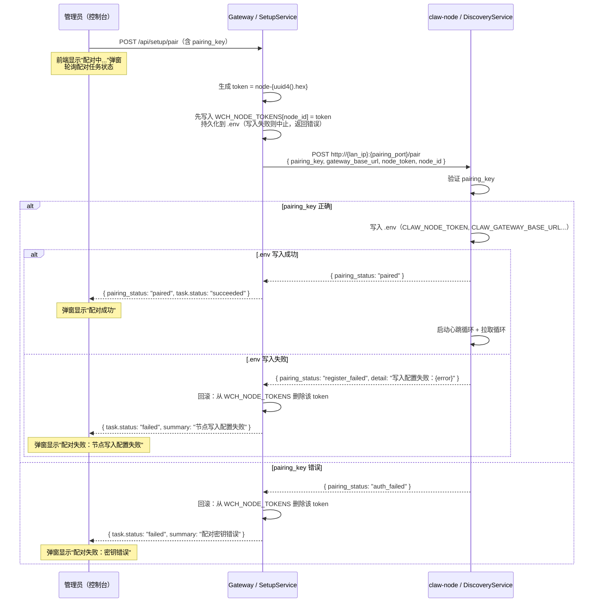
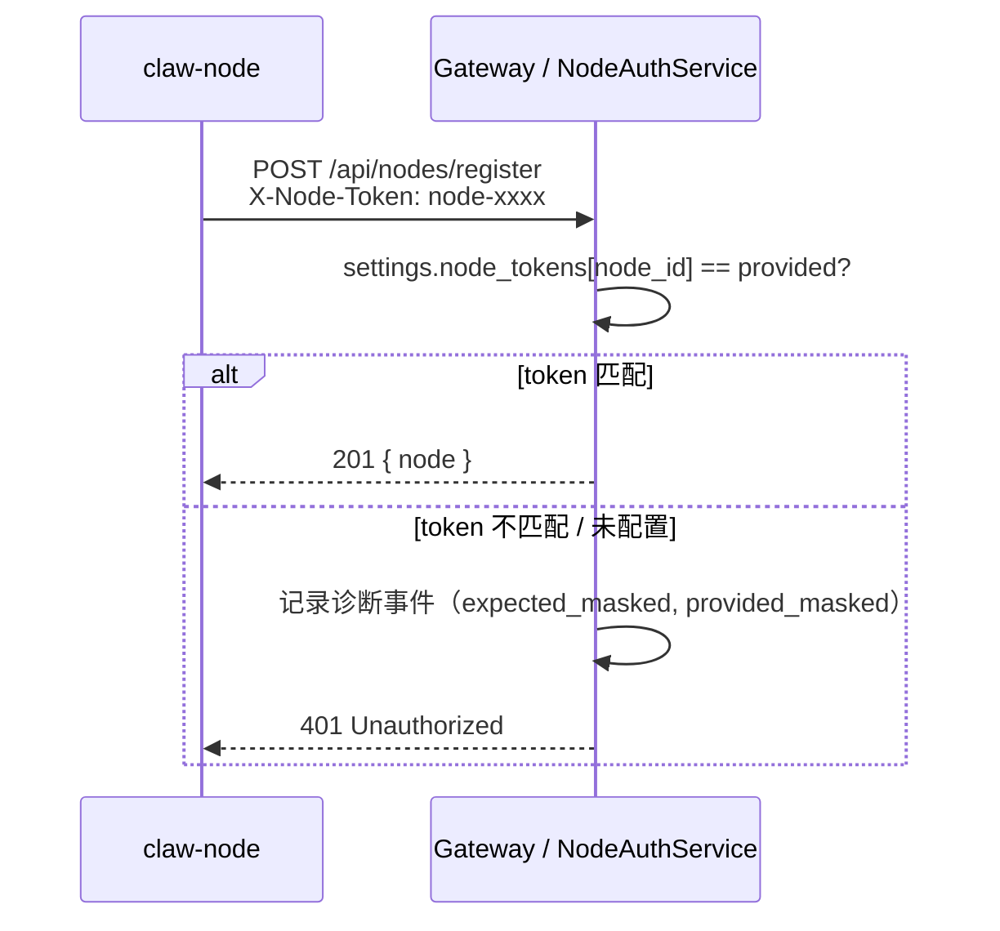
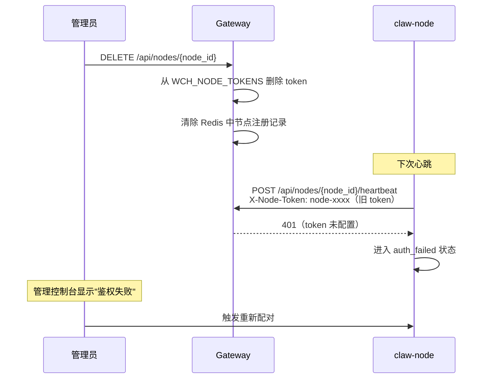

# 设计文档：node-dispatch

## 概述

本文档描述 **claw-node 工作节点** 与 **gateway 网关** 之间的连接与任务分发机制的完整设计。系统已具备可运行的基础实现，本文档在描述现有架构的同时，指出需要改进的地方。

核心目标：
- 节点通过局域网发现或手动配置完成与网关的一次性配对，获得 `node_token`
- 节点持续心跳维持在线状态，网关据此维护节点注册表
- 网关将入站消息封装为 `DispatchTask`，节点以轮询方式拉取并执行
- 调度器根据负载、通道占用、会话亲和性选择最优节点
- Token 鉴权贯穿所有节点 API，配对事务保证两端 token 始终一致

---

## 架构

### 整体拓扑

```mermaid
graph TB
    subgraph 用户侧
        WX[微信用户]
    end

    subgraph Gateway 进程
        API[FastAPI 路由层]
        AUTH[NodeAuthService]
        REG[NodeRegistry<br/>Redis 存储]
        DQ[DispatchQueue]
        DS[DispatchScheduler]
        SS[SetupService<br/>配对 & 诊断]
        OD[OutgoingDispatcher]
    end

    subgraph Redis
        NODES[(wch:nodes:active<br/>wch:node:{id}:meta)]
        QUEUE[(wch:dispatch:node:{id}<br/>wch:dispatch:task:{id})]
        SLOTS[(wch:node:{id}:slots)]
    end

    subgraph 节点侧（Windows 服务）
        DISC[DiscoveryService<br/>UDP + HTTP]
        GC[GatewayClient<br/>httpx]
        WORKER[Worker<br/>心跳 + 拉取循环]
        INF[推理后端<br/>Dify / OpenAI]
    end

    WX -->|微信消息| API
    API --> AUTH
    AUTH -->|验证 X-Node-Token| REG
    API --> DQ
    DQ --> DS
    DS --> REG
    DQ --> QUEUE
    REG --> NODES
    DQ --> SLOTS

    WORKER -->|register / heartbeat| GC
    GC -->|HTTP + X-Node-Token| API
    WORKER -->|pull-task 轮询| GC
    GC -->|task-result / task-failure| API
    WORKER --> INF
    DISC -->|UDP 广播响应| SS
    SS -->|POST /pair| DISC
    SS -->|写入 WCH_NODE_TOKENS| AUTH
    DQ --> OD
    OD --> WX
```

### 关键设计决策

1. **Pull 模式而非 Push**：节点主动轮询拉取任务，避免网关需要维护到节点的长连接，节点重启后自动恢复。
2. **Redis 作为任务队列**：每个节点有独立的 Redis List 队列（`wch:dispatch:node:{node_id}`），天然支持多节点并发消费。
3. **Slot 机制限制并发会话**：`channel_capacity` 限制单节点同时服务的会话数，与 `max_concurrency`（任务并发数）分开控制。
4. **Token 静态配置**：`WCH_NODE_TOKENS` 是 `dict[node_id, token]` 的环境变量，配对时原子写入，网关进程读取后缓存在 `Settings` 对象中。
5. **本机节点 bypass**：`local-node` 从本机 IP 发起的请求跳过 token 验证，简化本机部署。

---

## 组件与接口

### Gateway 侧组件

#### NodeAuthService

负责验证所有节点 API 请求的 token。

```
verify_request(request, node_id)
  ├── 若 node_id == local_node_id 且 client.host 在 _known_local_hosts() → bypass
  ├── 从 Authorization: Bearer <token> 或 X-Node-Token 提取 token
  ├── 查 settings.node_tokens[node_id]
  │   ├── 不存在 → 401，记录 rejected_missing_token 诊断事件
  │   └── 不匹配 → 401，记录 rejected_mismatch 诊断事件
  └── 匹配 → 记录 accepted 诊断事件，放行
```

**现有问题**：`_known_local_hosts()` 使用 `@lru_cache` 在进程启动时计算一次，网络接口变化后需重启网关才能刷新。需在文档中明确说明此限制。

#### NodeRegistry

以 Redis Hash 存储节点元数据，以 Redis Set 维护活跃节点集合。

关键 Redis 键：
- `wch:nodes:active` — 活跃节点 ID 集合（Set）
- `wch:node:{node_id}:meta` — 节点元数据（Hash）
- `wch:node:{node_id}:slots` — 会话 slot 占用表（Hash，slot_id → session_id）
- `wch:node:{node_id}:leases` — 预留（当前未使用）

TTL 策略：所有节点键的 TTL = `node_heartbeat_ttl_seconds * 2`，每次心跳刷新。超过 TTL 未心跳的节点在 `_parse_record` 中被标记为 `offline`。

#### DispatchScheduler

节点排序优先级（`rank_nodes`）：
1. 会话亲和节点（`session.assigned_node_id`），若可用且未满载
2. `healthy` 状态节点，按 `channel_in_use/channel_capacity` 升序
3. `degraded` 状态节点，同上排序
4. 其他非 `offline` 节点（队列等待）

`_can_assign` 条件：`status != OFFLINE` 且 `current_load < max_concurrency` 且 `channel_in_use < channel_capacity`。

`dispatch_mode_enabled = true` 时，从候选列表中排除 `local_node_id`。

#### DispatchQueue

任务生命周期：

```
入站消息
  → enqueue_for_inbound()
      ├── 检查 active_task_id（跳过或清理僵尸任务）
      ├── _ensure_slot_assignment()（分配或复用 slot）
      └── _enqueue_task()（写 Redis List + 更新 session 状态）

节点拉取
  → pull_for_node()
      ├── lpop(wch:dispatch:node:{node_id})
      ├── setex(wch:dispatch:inflight:{task_id}, TTL, node_id)
      └── 更新 session.queue_status = "inflight"

结果提交
  → submit_result()
      ├── 验证 context_version
      ├── append_bot_message()
      ├── OutgoingDispatcher.deliver_bot_reply()
      └── _cleanup_task()

失败提交
  → submit_failure()
      ├── retry_count == 0 → 切换节点重新入队
      └── retry_count >= 1 → 放弃，释放 slot
```

#### SetupService

负责配对流程的编排：
- UDP 广播扫描（`scan_discovery`）
- 向节点发送配对请求（`_pair_node`）
- 生成 token（`node-{uuid4().hex}`）并原子写入 `WCH_NODE_TOKENS`
- 维护内存中的配对诊断状态（`_pairing_diagnostics`）

**现有问题**：`_pairing_diagnostics` 存储在内存中，网关重启后丢失。诊断历史不持久化。

### 节点侧组件

#### DiscoveryService

- UDP 监听（`discovery_port`，默认 9531）：响应 `type: discover` 广播，返回节点身份信息
- HTTP 监听（`discovery_port + 1`，默认 9532）：处理 `POST /pair` 配对请求

#### GatewayClient

封装所有对网关的 HTTP 调用，在 `_ensure_client()` 中将 `X-Node-Token` 注入所有请求头。

接口：`register()` / `heartbeat()` / `pull_task()` / `submit_result()` / `submit_failure()`

#### Worker

主控协程，管理两个后台循环：
- `_heartbeat_loop`：每 `heartbeat_interval_seconds` 秒发送心跳，404 时自动重注册
- `_poll_loop`：每 `pull_interval_ms` 毫秒拉取任务，用 `asyncio.Semaphore` 控制并发

**现有问题**：节点收到 401 时当前实现会继续重试（`_heartbeat_loop` 捕获所有异常后继续循环）。需求 8.8 要求收到 401 后停止循环并标记 `auth_failed` 状态，当前未实现。

---

## 数据模型

### NodeRecord（运行态，存于 Redis）

| 字段 | 类型 | 说明 |
|------|------|------|
| node_id | str | 节点唯一标识 |
| base_url | str | 节点 HTTP 服务地址 |
| advertised_address | str \| None | 对外广播地址（可与 base_url 不同） |
| lan_ip | str \| None | 局域网 IP |
| max_concurrency | int | 最大并发任务数 |
| current_load | int | 当前活跃任务数 |
| channel_capacity | int | 最大并发会话通道数 |
| channel_in_use | int | 当前占用通道数（从 slots Hash 实时计算） |
| status | NodeStatus | healthy / degraded / busy / offline |
| last_heartbeat_at | datetime | 最近心跳时间 |
| load_ratio | float | current_load / max_concurrency |

### DispatchTask（任务，存于 Redis）

| 字段 | 类型 | 说明 |
|------|------|------|
| task_id | str | `task_{uuid4().hex}` |
| session_id | str | 关联会话 |
| node_id | str | 目标节点 |
| slot_id | str | `slot-{N:02d}` |
| context_version | int | 防乱序提交的版本号 |
| retry_count | int | 重试次数（最多 1 次） |
| message | MessageRecord | 当前消息 |
| recent_messages | list[MessageRecord] | 上下文消息列表 |

### Token 配置（Settings）

```python
node_tokens: dict[str, str]  # {node_id: token}
# 环境变量：WCH_NODE_TOKENS={"node-abc": "node-xxxx..."}
```

Token 格式：`node-{uuid4().hex}`（36 字符）

### NodeDiagnosticsRecord（诊断，存于内存）

记录每个节点的配对、注册、心跳、鉴权失败事件，包含 `timeline` 列表（最近 24 条事件）。

---

## Token 鉴权生命周期

这是系统中最容易出问题的环节，以下完整描述 token 从生成到失效的全过程。

### 阶段 1：配对（Token 生成与分发）

**节点初始状态**：节点启动时 `CLAW_NODE_TOKEN` 可以为空。空 token 时节点仅启动 `DiscoveryService`，不发起任何需要鉴权的请求，等待网关下发 token。



**写入顺序**：网关先写 `.env`，再向节点发配对请求。若节点侧失败，网关回滚删除已写入的 token，保证两端一致。

**前端配对弹窗设计**：
- 触发：管理员点击"配对"按钮后立即显示弹窗，进入 loading 状态
- 轮询：前端每 1.5 秒轮询 `GET /api/setup/tasks/{task_id}` 获取配对任务状态
- 成功：`task.status == "succeeded"` → 弹窗显示绿色"配对成功"，2 秒后自动关闭，刷新节点列表
- 失败：`task.status == "failed"` → 弹窗显示红色错误信息（`task.summary`），提供"重试"和"关闭"按钮
- 超时：前端轮询超过 30 秒未完成 → 显示"配对超时，请检查节点是否在线"
- 状态文案：
  - `running` → "正在连接节点..."
  - `succeeded` → "配对成功，节点已上线"
  - `failed` + summary 含"密钥" → "配对失败：密钥错误，请检查配对密钥是否一致"
  - `failed` + summary 含"写入" → "配对失败：节点配置写入失败，请检查节点磁盘权限"
  - `failed` + 其他 → "配对失败：{task.summary}"

### 阶段 2：正常运行（Token 验证）



所有节点 API（register / heartbeat / pull-task / task-result / task-failure）均经过相同的 `NodeAuthService.verify_request()` 验证。

### 阶段 3：401 处理（节点侧）

**现有实现**：`_heartbeat_loop` 捕获所有异常后记录 `last_error` 并继续循环，不区分 401 与其他错误。

**需求要求**（8.8）：收到 401 后应停止心跳和拉取循环，标记 `auth_failed` 状态，不自动重试。

**改进方案**：
```python
except httpx.HTTPStatusError as exc:
    if exc.response.status_code == 401:
        logger.error("Node auth failed (401). Stopping loops.")
        self._auth_failed = True
        self._shutdown.set()  # 或单独的 auth_failed_event
        return
    elif exc.response.status_code == 404:
        # 现有逻辑：重注册
        ...
```

### 阶段 4：Token 重置



### 阶段 5：本机节点 Bypass

`local-node` 从 `127.0.0.1` / `::1` / 本机 IP 发起的请求跳过 token 验证。`_known_local_hosts()` 在进程启动时通过 `socket.getaddrinfo` 计算，结果被 `@lru_cache` 缓存。

**限制**：网络接口变化（如新增网卡）后需重启网关进程才能识别新 IP。

---

## 正确性属性

*属性（Property）是在系统所有合法执行路径上都应成立的特征或行为——本质上是对系统应做什么的形式化陈述。属性是人类可读规范与机器可验证正确性保证之间的桥梁。*

### 属性 1：心跳超时导致节点离线

*对于任意节点记录*，若其 `last_heartbeat_at` 距当前时间超过 `node_heartbeat_ttl_seconds * 2` 秒，则 `NodeRegistry.get()` 返回的节点状态必须为 `offline`，无论 Redis 中存储的原始状态为何值。

**验证：需求 3.4**

### 属性 2：满载节点状态为 busy

*对于任意节点记录*，若 `current_load >= max_concurrency`，则 `NodeRegistry` 返回的节点状态必须为 `busy`（非 `offline` 时）。

**验证：需求 3.3**

### 属性 3：Token 验证一致性

*对于任意 node_id 和任意 token 字符串*，`NodeAuthService.verify_request()` 接受请求当且仅当提供的 token 与 `settings.node_tokens[node_id]` 完全相等（区分大小写）。

**验证：需求 8.2**

### 属性 4：调度器不选满通道节点

*对于任意会话和任意节点列表*，若某节点的 `channel_in_use >= channel_capacity`，则 `DispatchScheduler.rank_nodes()` 不应将该节点列为可立即分配的候选节点（即不出现在 `_can_assign` 为 true 的位置）。

**验证：需求 6.5**

### 属性 5：调度器排除本机节点（dispatch 模式）

*对于任意节点列表*，当 `dispatch_mode_enabled = true` 时，`DispatchScheduler.rank_nodes()` 返回的列表中不应包含 `node_id == local_node_id` 的节点。

**验证：需求 6.6**

### 属性 6：任务结果 context_version 一致性

*对于任意任务提交*，`DispatchQueue.submit_result()` 当且仅当 `payload.context_version == task.context_version` 时接受提交，否则拒绝并返回错误。

**验证：需求 5.3**

### 属性 7：Slot 分配唯一性

*对于任意节点和任意会话集合*，`wch:node:{node_id}:slots` 哈希中每个 slot_id 最多被一个 session_id 占用，且 slot 数量不超过 `channel_capacity`。

**验证：需求 6.4**

### 属性 8：任务重试上限

*对于任意失败任务*，`DispatchQueue.submit_failure()` 在 `retry_count >= 1` 时不再重新入队，直接释放 slot。

**验证：需求 5.7**

### 属性 9：配对 key 验证

*对于任意配对请求*，`Worker._handle_pair_request()` 当且仅当 `pairing_key` 与 `settings.pairing_key` 完全匹配时返回成功，否则返回 401。

**验证：需求 1.3**

### 属性 10：节点排序稳定性

*对于任意两个状态相同的节点 A 和 B*，若 `A.channel_in_use/A.channel_capacity < B.channel_in_use/B.channel_capacity`，则 A 在 `rank_nodes()` 结果中排在 B 之前。

**验证：需求 6.3**

---

## 错误处理

### 节点侧错误处理

| 场景 | 当前行为 | 需求要求 | 是否需要改进 |
|------|----------|----------|-------------|
| 心跳返回 404 | 自动重注册 ✓ | 需求 3.5 | 否 |
| 心跳返回 401 | 记录错误，继续循环 ✗ | 停止循环，标记 auth_failed | **是** |
| 心跳网络错误 | 记录 last_error，下周期重试 ✓ | 需求 3.6 | 否 |
| 任务执行异常 | submit_failure() ✓ | 需求 5.5 | 否 |
| 拉取任务失败 | 记录错误，等待下周期 ✓ | 需求 4.1 | 否 |

### 网关侧错误处理

| 场景 | 处理方式 |
|------|----------|
| Redis 不可用 | `ensure_redis_available()` 返回 503 |
| 节点不存在（heartbeat） | 返回 404，触发节点重注册 |
| token 未配置 | 返回 401，记录 `rejected_missing_token` 诊断 |
| token 不匹配 | 返回 401，记录 `rejected_mismatch` 诊断（含掩码对比） |
| context_version 不匹配 | 返回 409，拒绝结果提交 |
| inflight 任务超时 | 下次入队时自动清理僵尸任务（`_recover_stale_dispatch_if_needed`） |
| slot 空闲超时 | 下次入队时自动释放（`_release_expired_slot_if_needed`） |

### 诊断可观测性

- `GET /api/nodes/{node_id}/diagnostics`：返回完整诊断记录，含 token 掩码对比
- `GET /api/nodes`：每个节点包含 `connection_state`（connected / pairing_pending / register_failed / auth_failed / paired_offline / online_unpaired）
- 所有鉴权事件通过 `SetupService.record_auth_event()` 写入内存诊断时间线

---

## 测试策略

### 单元测试

针对具体示例和边界条件：

- `NodeAuthService`：token 匹配、token 不匹配、token 未配置、本机 bypass、掩码格式
- `NodeRegistry`：心跳超时标记 offline、满载标记 busy、TTL 刷新
- `DispatchScheduler`：亲和节点优先、满通道排除、dispatch 模式排除本机节点
- `DispatchQueue`：context_version 校验、retry_count 上限、僵尸任务清理、slot 空闲超时释放
- `Worker._handle_pair_request`：pairing_key 验证、已配对节点返回 already_paired

### 属性测试

使用 [Hypothesis](https://hypothesis.readthedocs.io/)（Python PBT 库），每个属性测试最少运行 100 次。

每个测试用注释标注对应属性：
```python
# Feature: node-dispatch, Property 1: 心跳超时导致节点离线
@given(...)
@settings(max_examples=100)
def test_stale_node_marked_offline(...):
    ...
```

属性测试覆盖：

| 测试 | 对应属性 |
|------|----------|
| 生成随机 `last_heartbeat_at`，验证超时判断 | 属性 1 |
| 生成随机 `current_load / max_concurrency`，验证 busy 判断 | 属性 2 |
| 生成随机 token 对，验证 verify_request 接受/拒绝逻辑 | 属性 3 |
| 生成随机节点列表，验证满通道节点不出现在可分配候选中 | 属性 4 |
| 生成随机节点列表（含 local-node），验证 dispatch 模式排除 | 属性 5 |
| 生成随机 context_version 对，验证提交接受/拒绝 | 属性 6 |
| 生成随机会话集合，验证 slot 分配唯一性 | 属性 7 |
| 生成随机 retry_count，验证重试上限 | 属性 8 |
| 生成随机 pairing_key 对，验证配对验证逻辑 | 属性 9 |
| 生成随机节点对，验证排序稳定性 | 属性 10 |

### 集成测试

- 完整配对流程（UDP 发现 → HTTP 配对 → token 写入 → 注册 → 心跳）
- 任务完整生命周期（入队 → 拉取 → 执行 → 提交结果 → 清理）
- 节点失败重试（submit_failure → 切换节点 → 重新入队）
- 401 处理（token 重置 → 心跳 401 → auth_failed 状态）
