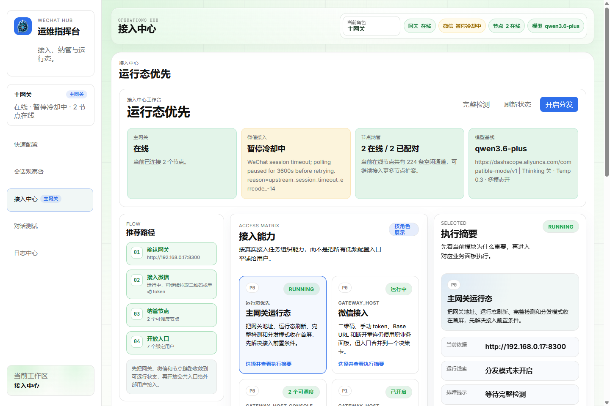
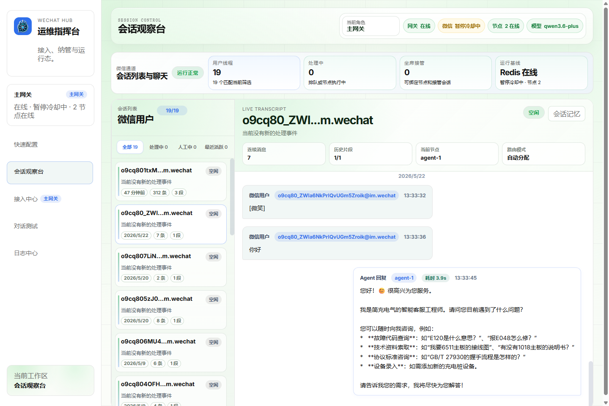
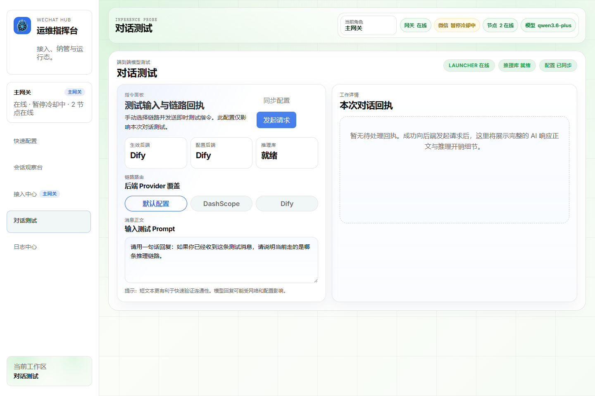

# WeChat Claw Hub

> 把微信个人号、微信公众号接入 Dify 和 OpenAI 兼容模型的开源 AI 网关。

[](https://www.python.org/)
[](https://fastapi.tiangolo.com/)
[](https://react.dev/)
[](https://vite.dev/)
[](https://redis.io/)
[](LICENSE)

WeChat Claw Hub 是一个面向微信 AI 接入场景的网关系统。它把微信消息统一接入后端网关，再转发给 Dify 知识库或任意 OpenAI 兼容模型，并通过 React 控制台实时查看会话、配置模型、排查连接状态。

如果你正在做下面这些事情，它可以直接作为起点：

- 给微信个人号或公众号接入 AI 问答能力
- 把 Dify 知识库包装成微信里的可用助手
- 用 DashScope、Ollama、OpenAI 兼容接口快速验证微信 AI 工作流
- 在一个控制台里观察会话、消息时间线、模型连通性和微信接入状态

## 界面预览

### 接入中心

网关、微信、节点和模型状态集中展示，适合日常运维和接入排查。



### 会话观察台

按 Agent 查看会话列表、当前处理状态、消息时间线和节点绑定信息。



### 对话测试

直接发送测试消息，验证 OpenAI 兼容模型或 Dify 配置是否能正常返回回复。



## 开源版包含什么

当前开源分支聚焦单机网关和控制台体验，适合本地开发、演示验证和轻量部署。

| 能力 | 开源版状态 |
| --- | --- |
| FastAPI 网关 | 支持 |
| React 控制台 | 支持 |
| 微信个人号接入 | 支持 ilink 平台扫码接入 |
| 微信公众号接入 | 支持官方回调、AES 解密、客服消息 |
| Dify 知识库 | 支持 |
| OpenAI 兼容模型 | 支持 DashScope、Ollama、OpenAI 等 |
| 会话上下文隔离 | 支持 Redis 会话状态和 transcript |
| 实时会话观察 | 支持 HTTP + WebSocket 更新 |

README 中的快速开始默认按单机网关 + 控制台路径说明。

## 开源版暂不支持什么

以下能力不包含在当前开源 demo 分支中。如需这些能力、完整商业版授权或定制集成，请联系作者沟通：

| 能力 | 开源版状态 |
| --- | --- |
| 分布式工作节点 | 暂不支持跨机器节点注册、发现、心跳、重装升级和远程启停 |
| 跨机器调度 | 暂不支持多节点任务分发、容量评估、自动故障切换 |
| 人工接管 / 坐席台 | 暂不支持完整人工介入、坐席分配、会话接管闭环 |
| 桌面启动器 / EXE | 暂不提供一键安装包、自动升级器和 Windows 桌面运维入口 |
| 多租户与权限体系 | 暂不支持团队、角色权限、审计日志和隔离配置 |
| 商业化部署支持 | 暂不包含生产部署陪跑、私有化改造和 SLA 支持 |

开源版适合作为微信 AI 网关、本地演示和二次开发起点；如果你的场景需要节点端、坐席台、自动升级或企业级部署支持，请联系作者获取对应版本或定制方案。

## 架构概览

```text
微信个人号 / 微信公众号
          |
          v
┌──────────────────────┐
│  API Gateway          │
│  FastAPI              │
│  消息接入 / 会话管理 / 模型调用 │
└──────────┬───────────┘
           |
   ┌───────┼──────────────┐
   v       v              v
Dify   OpenAI 兼容模型   Redis
知识库  DashScope/Ollama  会话状态
           |
           v
┌──────────────────────┐
│  Agent Console        │
│  React + Vite         │
│  配置 / 会话观察 / 连通性检测 │
└──────────────────────┘
```

## 核心特性

### 微信接入

- 个人号扫码接入：通过 ilink 平台获取二维码并轮询配对状态
- 公众号官方回调：支持 URL 验证、消息解密、重复回调去重
- 文本和媒体消息：支持文本、图片等输入，并保存媒体引用
- 主动回复能力：网关可向微信侧发送 AI 回复或系统提示

### AI 与知识库

- Dify 集成：配置 `WCH_DIFY_BASE_URL` 和 `WCH_DIFY_API_KEY` 即可转发问答
- OpenAI 兼容模型：支持 DashScope、Ollama、OpenAI 以及其他兼容接口
- 参数可调：支持 temperature、top_p、thinking、search、多模态等配置
- 无模型模式：也可以只做微信消息接入和转发，方便二次开发

### 控制台

- 快速配置：在前端完成网关、模型、Dify、微信参数配置
- 会话观察：查看活跃会话、聊天时间线和消息状态
- 连通性检测：一键检查模型、网关、微信接入是否可用
- 实时更新：会话列表和系统摘要支持 WebSocket 推送

## 快速开始

### 环境要求

- Python 3.11+
- Node.js 18+
- Redis 7+

### 1. 启动 Redis

确保本机 Redis 可访问，默认地址为：

```env
WCH_REDIS_URL=redis://127.0.0.1:6379/0
```

### 2. 启动网关

```bash
cd apps/gateway

python -m venv .venv
source .venv/bin/activate  # Windows: .venv\Scripts\activate

pip install -e .
cp .env.example .env

uvicorn app.main:app --reload --port 8300
```

网关启动后可以访问：

- `http://localhost:8300/`
- `http://localhost:8300/docs`
- `http://localhost:8300/api/system/status`

### 3. 启动控制台

```bash
cd apps/agent-console

npm install
npm run dev
```

打开 `http://localhost:5174`，进入控制台后选择“网关”或“网关+控制台”角色完成配置。

### 4. 配置模型或 Dify

直接调用 OpenAI 兼容模型：

```env
WCH_BUILTIN_MODEL_BASE_URL=https://dashscope.aliyuncs.com/compatible-mode/v1
WCH_BUILTIN_MODEL_API_KEY=your-api-key
WCH_BUILTIN_MODEL_NAME=qwen-plus
```

使用本地 Ollama：

```env
WCH_BUILTIN_MODEL_BASE_URL=http://localhost:11434/v1
WCH_BUILTIN_MODEL_API_KEY=ollama
WCH_BUILTIN_MODEL_NAME=qwen2.5:7b
```

接入 Dify 知识库：

```env
WCH_DIFY_BASE_URL=http://your-dify-server:3000/v1
WCH_DIFY_API_KEY=app-your-dify-api-key
```

### 5. 接入微信

个人号接入：

```env
WCH_WECHAT_BASE_URL=https://ilinkai.weixin.qq.com
WCH_WECHAT_TOKEN=your-wechat-token
```

公众号接入：

```env
WCH_WECHAT_MP_APP_ID=your-mp-app-id
WCH_WECHAT_MP_APP_SECRET=your-mp-app-secret
WCH_WECHAT_MP_TOKEN=your-mp-token
WCH_WECHAT_MP_ENCODING_AES_KEY=your-encoding-aes-key
```

## 常用环境变量

完整模板见 [apps/gateway/.env.example](apps/gateway/.env.example)。

| 变量 | 说明 |
| --- | --- |
| `WCH_REDIS_URL` | Redis 连接地址 |
| `WCH_DEFAULT_AGENT_ID` | 默认 Agent 标识 |
| `WCH_BUILTIN_MODEL_*` | OpenAI 兼容模型配置 |
| `WCH_DIFY_*` | Dify 知识库配置 |
| `WCH_WECHAT_*` | 微信个人号接入配置 |
| `WCH_WECHAT_MP_*` | 微信公众号配置 |
| `WCH_PUBLIC_ENTRY_*` | 公共入口页面配置 |
| `WCH_CONSOLE_GATEWAY_BASE_URL` | 控制台访问网关的地址 |

## 核心 API

网关启动后可在 `/docs` 查看完整 OpenAPI 文档。常用接口如下：

| 分组 | 接口 |
| --- | --- |
| 系统状态 | `GET /api/system/status`, `GET /api/system/summary` |
| 模型检测 | `GET /api/models/builtin/status`, `POST /api/models/builtin/check` |
| 微信扫码 | `POST /api/wechat/onboard/start`, `POST /api/wechat/onboard/poll`, `POST /api/wechat/onboard/connect` |
| 公众号 | `GET /api/wechat/mp/callback`, `POST /api/wechat/mp/callback` |
| 会话 | `GET /api/sessions`, `GET /api/sessions/{session_id}`, `GET /api/sessions/{session_id}/messages` |
| 入站消息 | `POST /api/messages/inbound` |
| 公共入口 | `GET /entry`, `POST /api/public-entry/tickets` |

## 项目结构

```text
wechat-claw-hub/
├── apps/
│   ├── gateway/              # FastAPI 网关服务
│   │   ├── app/
│   │   │   ├── api/routes/   # HTTP 和 WebSocket 路由
│   │   │   ├── access/       # 微信个人号 / 公众号接入
│   │   │   ├── core/         # 配置、依赖、生命周期
│   │   │   ├── models/       # Pydantic 数据模型
│   │   │   └── services/     # 会话、模型、Redis、配置等服务
│   │   ├── tests/            # 网关测试
│   │   └── .env.example
│   └── agent-console/        # React 控制台
│       ├── src/
│       │   ├── components/   # 工作区和 UI 组件
│       │   ├── hooks/        # 控制台状态和轮询逻辑
│       │   └── types/        # 前端类型定义
│       └── package.json
├── docs/                     # 架构、运行和集成文档
├── services/                 # 节点相关服务代码
├── scripts/                  # 本地运行和辅助脚本
└── README.md
```

## 开发与验证

网关测试：

```bash
cd apps/gateway
python -m pytest tests
```

控制台构建：

```bash
cd apps/agent-console
npm run build
```

节点服务测试：

```bash
cd services/claw-node
python -m pytest tests
```

## 文档

- [运行手册](docs/operations-guide.md)
- [架构概览](docs/architecture-overview.md)
- [Dify 参考](docs/dify参考.md)
- [微信公众号集成说明](docs/wechat-mp-integration-notes.md)

## 常见问题

### 支持哪些模型？

只要提供 OpenAI 兼容接口，就可以接入。常见选择包括 DashScope、Ollama、OpenAI API 和企业内部兼容网关。

### 一定要配置 Dify 吗？

不需要。Dify 和内置 OpenAI 兼容模型可以按需选择。你也可以只使用微信接入和会话管理能力，再接自己的处理逻辑。

### 可以生产部署吗？

可以，但建议先按 [运行手册](docs/operations-guide.md) 梳理 Redis、网关进程、控制台访问地址和微信回调公网地址。当前 README 只提供本地开发路径。

### 开源版和高级能力的区别是什么？

开源版优先保证单机网关、控制台、微信接入、Dify/模型调用和会话观察体验。多节点分布式调度、独立工作节点部署和人工接管等能力属于更完整的运行形态，不作为当前开源 README 的默认路径。

## 贡献与反馈

欢迎提交 Issue、PR 或使用反馈。比较适合贡献的方向包括：

- 新模型服务商适配
- 微信消息类型补充
- 控制台交互优化
- 部署文档和示例配置
- 测试覆盖和问题复现用例

## License

本项目采用 [MIT License](LICENSE) 开源协议。

---

**WeChat Claw Hub** - 让微信接入 AI 变得简单、可观测、可扩展。
